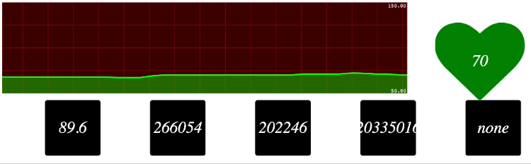

IoT Gateway
-----------

nodeJS server for receiving streaming data from mobile apps and persist into  time-series database (InfluxDB)


### Setup
```bash
npm install
```


### Run
```
node app.js
```


### Access Streaming UX
```
http://localhost:3010/
```

