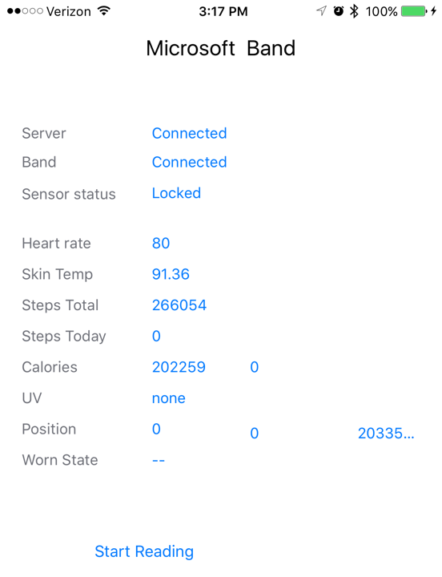

Wearable Hub App
----------------
Aggregate all your wearable sensor's data and visualize with one **app**. 

1. Bring your own device. 
2. Share your data with your preferred cloud provider (Google Fit, Microsoft Health Cloud etc.,) 
3. Works with any HealthKit compatible device. 

